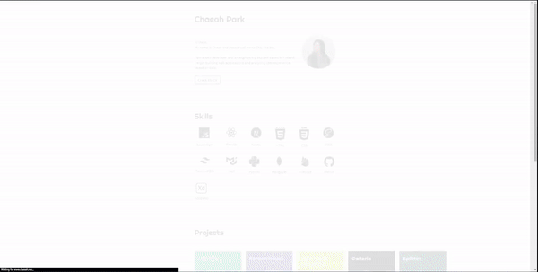

# chaeah.me

<p align="center">
  
</p>

- Framework: Next.js
- Deployment: Vercel
- Styles: Tailwind CSS

## My plans are to ...

- [x] ~~Upgrade to Next.js 13 (Done: 27th Aug 2023)~~ 
- [ ] Create database
- [ ] Add features on blog (comments, categorize by tags)
- [ ] Add Open Graph protocol markup
- [ ] Connect to Google Analytics
- [ ] Connect to CMS
- [ ] Automate testing
- [ ] Improve the architectur

## How to run locally

```
git clone https://github.com/chepark/portfolio
cd portfolio
npm install
npm run dev
```
